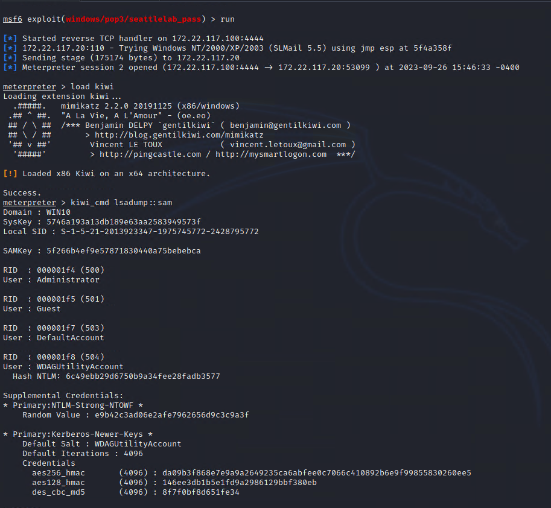

## Confidentiality Statement

This document contains confidential and privileged information from Rekall Inc. (henceforth known as Rekall). The information contained in this document is confidential and may constitute inside or non-public information under international, federal, or state laws. Unauthorized forwarding, printing, copying, distribution, or use of such information is strictly prohibited and may be unlawful. If you are not the intended recipient, be aware that any disclosure, copying, or distribution of this document or its parts is prohibited.

## Table of Contents

[Confidentiality Statement](#confidentiality-statement)

[Contact Information](#contact-information)

[Document History](#document-history)

[Introduction](#introduction)

[Assessment Objective](#assessment-objective)

[Penetration Testing Methodology](#penetration-testing-methodology)

[Reconnaissance](#reconnaissance)

[Identification of Vulnerabilities and Services](#identification-of-vulnerabilities-and-services)

[Vulnerability Exploitation](#vulnerability-exploitation)

[Reporting](#reporting)

[Scope](#scope)

[Executive Summary of Findings](#executive-summary-of-findings)

[Grading Methodology](#grading-methodology)

[Summary of Strengths](#summary-of-strengths)

[Summary of Weaknesses](#summary-of-weaknesses)

[Executive Summary Narrative](#executive-summary)

[Summary Vulnerability Overview](#summary-vulnerability-overview)

[Vulnerability Findings](#vulnerability-findings)

$%$

## Contact Information

| **Company Name**  | The Pantheon Hackers |
|-------------------|----------------------|
| **Contact Name**  | Alice Lee            |
| **Contact Title** | Penetration Tester   |

$%$

## Document History

| **Version** | **Date** | **Author(s)** | **Comments** |
|-------------|----------|---------------|--------------|
| 001         | 09/22/23 | Alice Lee     |              |

$%$

## Introduction

In accordance with Rekall policies, our organization conducts external and internal penetration tests of its networks and systems throughout the year. The purpose of this engagement was to assess the networks’ and systems’ security and identify potential security flaws by utilizing industry-accepted testing methodology and best practices.

For the testing, we focused on the following:

-   Attempting to determine what system-level vulnerabilities could be discovered and exploited with no prior knowledge of the environment or notification to administrators.
-   Attempting to exploit vulnerabilities found and access confidential information that may be stored on systems.
-   Documenting and reporting on all findings.

All tests took into consideration the actual business processes implemented by the systems and their potential threats; therefore, the results of this assessment reflect a realistic picture of the actual exposure levels to online hackers. This document contains the results of that assessment.

### Assessment Objective

The primary goal of this assessment was to provide an analysis of security flaws present in Rekall’s web applications, networks, and systems. This assessment was conducted to identify exploitable vulnerabilities and provide actionable recommendations on how to remediate the vulnerabilities to provide a greater level of security for the environment.

We used our proven vulnerability testing methodology to assess all relevant web applications, networks, and systems in scope.

Rekall has outlined the following objectives:

Table 1: Defined Objectives

| **Objective**                                                    |
|------------------------------------------------------------------|
| Find and exfiltrate any sensitive information within the domain. |
| Escalate privileges.                                             |
| Compromise several machines.                                     |

$%$

## Penetration Testing Methodology

### Reconnaissance

### 

We begin assessments by checking for any passive (open source) data that may assist the assessors with their tasks. If internal, the assessment team will perform active recon using tools such as Nmap and Bloodhound.

### Identification of Vulnerabilities and Services

We use custom, private, and public tools such as Metasploit, hashcat, and Nmap to gain perspective of the network security from a hacker’s point of view. These methods provide Rekall with an understanding of the risks that threaten its information, and also the strengths and weaknesses of the current controls protecting those systems. The results were achieved by mapping the network architecture, identifying hosts and services, enumerating network and system-level vulnerabilities, attempting to discover unexpected hosts within the environment, and eliminating false positives that might have arisen from scanning.

### Vulnerability Exploitation

Our normal process is to both manually test each identified vulnerability and use automated tools to exploit these issues. Exploitation of a vulnerability is defined as any action we perform that gives us unauthorized access to the system or the sensitive data.

### Reporting

Once exploitation is completed and the assessors have completed their objectives, or have done everything possible within the allotted time, the assessment team writes the report, which is the final deliverable to the customer.

$%$

## Scope

Prior to any assessment activities, Rekall and the assessment team will identify targeted systems with a defined range or list of network IP addresses. The assessment team will work directly with the Rekall POC to determine which network ranges are in-scope for the scheduled assessment.

It is Rekall’s responsibility to ensure that IP addresses identified as in-scope are actually controlled by Rekall and are hosted in Rekall-owned facilities (i.e., are not hosted by an external organization). In-scope and excluded IP addresses and ranges are listed below.

$%$

## Executive Summary of Findings

### Grading Methodology

Each finding was classified according to its severity, reflecting the risk each such vulnerability may pose to the business processes implemented by the application, based on the following criteria:

**Critical**: Immediate threat to key business processes.

**High**: Indirect threat to key business processes/threat to secondary business processes.

**Medium**: Indirect or partial threat to business processes.

**Low**: No direct threat exists; vulnerability may be leveraged with other vulnerabilities.

Informational: No threat; however, it is data that may be used in a future attack.

As the following grid shows, each threat is assessed in terms of both its potential impact on the business and the likelihood of exploitation:

$%$

### Summary of Strengths

While the assessment team was successful in finding several vulnerabilities, the team also recognized several strengths within Rekall’s environment. These positives highlight the effective countermeasures and defenses that successfully prevented, detected, or denied an attack technique or tactic from occurring.

-   Basic level of input validation was implemented on an HTML page
-   Website certificate (SSL) was secured with root and CA certificate of a third party
-   Implementation of rudimentary security levels across Web Application, Linux, and Windows

### Summary of Weaknesses

We successfully found several critical vulnerabilities that should be immediately addressed in order to prevent an adversary from compromising the network. These findings are not specific to a software version but are more general and systemic vulnerabilities.

-   Certain IP addresses and ports were open for exploits
-   Vulnerabilities were found on the Web Application, Linux, and Windows system
-   Exposure of user credentials and privilege escalation
-   Meterpreter shell sessions
-   Out-of-date plug-ins

$%$

## Executive Summary

This report presents the results of penetration testing for Rekall Corporation. The Pantheon Hackers identified numerous vulnerabilities from their security system ranging from exploitation of web servers to privilege escalation. The test was performed through Web Application, Linux, and Windows to determine the impact of said vulnerabilities that were found.

From The Web Application stance, certain web pages allowed access of the directory and exposure of sensitive data. Attacks such as XSS reflected and stored attacks, local file inclusion, SQL injection, Directory Traversal, Brute Force Attack, and Exposed User Credentials were found to be possible exploits. XSS reflected and stored attacks were performed on the home page. A Local File Inclusion was performed on the website’s VR Planner page which allowed an upload of a PHP file. SQL injection was run successfully in the Login page. The Networking.php and the Disclaimer page allowed for backend access of the directory. User credentials were found on the page source of the Login.php. Sensitive data was able to be accessed with no restrictions when changing the subdirectory. A brute force attack was done successfully through the admin_legal_data.php page for admin access. User Credentials were also found on WHOIS record as well as the company’s public github repository of their old site.

From the Linux approach, our company revealed open hosts and ports when the IP address subnet was scanned through nmap. An aggressive scan of certain hosts exposed open ports that were successfully exploited through connection. Sessions revealed out-of-date Apache and Drupal as vulnerabilities that were able to be exploited through Meterpreter. Privilege escalation to root was successful from exposed user credentials. Usernames and hashed passwords were found on web applications of the company and cracked using john.

Lastly, the Windows environment was discovered to have two open ports for an IP address of a virtual remote desktop: port 21 and port 110. Port 21 was used to gain anonymous access to FTP. Port 110 was used to gain access to SLMail service through Metasploit. Through successful meterpreter session of SLMail, Kiwi was used for credential dumping of users and hashed passwords.

In conclusion, all of these vulnerabilities pose a risk to the business and can cause damage should a bad actor use it to their advantage. The Pantheon Hackers have listed each vulnerability that was found and ways to mitigate each one.

$%$

## Summary Vulnerability Overview

| **Vulnerability**                                                                                   | **Severity** |
|-----------------------------------------------------------------------------------------------------|--------------|
| XSS Reflected Attacks                                                                               | **Critical** |
| XSS Stored Attack                                                                                   | **Critical** |
| Local File Inclusion of a PHP file                                                                  | **Critical** |
| SQL injection                                                                                       | **Critical** |
| Directory Traversal in Networking.php                                                               | **Critical** |
| Directory Traversal in Disclaimer.php                                                               | **Critical** |
| Exposure of User Credentials                                                                        | **Critical** |
| Access to Robots.txt File                                                                           | **Medium**   |
| Brute Force Attack                                                                                  | **Critical** |
| Exposed Sensitive data through Open Source                                                          | **Critical** |
| Nmap Scan Results                                                                                   | **High**     |
| Nmap Aggressive Scan Results                                                                        | **High**     |
| Meterpreter Shell Session of 192.168.13.13 (Drupal RESTful Web Services unserialize () RCE)         | **Critical** |
| Nessus Scan Results                                                                                 | **Critical** |
| Meterpreter Shell Session of 192.168.13.12 (Apache Struts Jakarta Multipart Parser OGNL injection)  | **Critical** |
| Privilege Escalation                                                                                | **Critical** |
| Exposed User Credentials                                                                            | **Critical** |
| User Access for IP address from Stolen Credentials                                                  | **Critical** |
| FTP Enumeration through Anonymous Identity                                                          | **Critical** |
| Meterpreter Session of 172.22.117.20 (Seattle Lab Mail 5.5 POP3 Buffer Overflow)                    | **Critical** |
| Kiwi LSA Dump SAM                                                                                   | **Critical** |

$%$

The following summary tables represent an overview of the assessment findings for this penetration test:

| **Scan Type** | **Total**                                                                                                         |
|---------------|-------------------------------------------------------------------------------------------------------------------|
| Hosts         |  172.22.117.20 172.22.117.100 192.168.13.10 192.168.13.12 192.168.13.13 192.168.13.14 192.168.13.1 192.168.14.35  |
| Ports         |  8080 80 21 22 110                                                                                                |

| **Exploitation Risk** | **Total** |
|-----------------------|-----------|
|  **Critical**         | 18        |
|  **High**             | 2         |
|  **Medium**           | 0         |
|  **Low**              | 1         |

$%$

## Vulnerability Findings

| **Vulnerability 1**                        | **Findings**                                                                                                                                                                                                                                                                                                                   |
|--------------------------------------------|--------------------------------------------------------------------------------------------------------------------------------------------------------------------------------------------------------------------------------------------------------------------------------------------------------------------------------|
| **Title**                                  | XSS Reflected Attacks                                                                                                                                                                                                                                                                                                          |
| **Type (Web app / Linux OS / Windows OS)** | Web Application                                                                                                                                                                                                                                                                                                                |
| **Risk Rating**                            | Critical                                                                                                                                                                                                                                                                                                                       |
| **Description**                            | Malicious script was inputted and payload was successfully reflected on the welcome page:   \<script\>alert(“ali was here”)\</script\>  Malicious script was inputted and payload was successfully reflected through the Memory Planner page despite input validation:   \<scrscriptipt\>alert(“ali was here”)\<scrscriptipt\> |
| **Images**                                 |                                                                                                                                                                                                                                  |
| **Affected Hosts**                         | 192.168.14.35                                                                                                                                                                                                                                                                                                                  |
| **Remediation**                            | Implement a web application firewall to mitigate against this attack                                                                                                                                                                                                                                                           |

| **Vulnerability 2**                        | **Findings**                                                                                                                                                                   |
|--------------------------------------------|--------------------------------------------------------------------------------------------------------------------------------------------------------------------------------|
| **Title**                                  | XSS Stored Attack                                                                                                                                                              |
| **Type (Web app / Linux OS / Windows OS)** | Web Application                                                                                                                                                                |
| **Risk Rating**                            | Critical                                                                                                                                                                       |
| **Description**                            | Malicious script was injected successfully and accepted within the database. Response was posted as active content comments page:   \<script\>alert(“ali was here”)\</script\> |
| **Images**                                 |                                                                                                                                 |
| **Affected Hosts**                         | 192.168.14.35                                                                                                                                                                  |
| **Remediation**                            | Restrict characters and input involving possible malicious string through output escaping.                                                                                     |

| **Vulnerability 3**                        | **Findings**                                                                                     |
|--------------------------------------------|--------------------------------------------------------------------------------------------------|
| **Title**                                  | Local File Inclusion                                                                             |
| **Type (Web app / Linux OS / Windows OS)** | Web Application                                                                                  |
| **Risk Rating**                            | Critical                                                                                         |
| **Description**                            | Successful upload of a PHP file onto Memory Planner VR page.                                     |
| **Images**                                 |    |
| **Affected Hosts**                         | 192.168.14.35                                                                                    |
| **Remediation**                            | Whitelist files that can be uploaded to the web server.                                          |

| **Vulnerability 4**                        | **Findings**                                                                                     |
|--------------------------------------------|--------------------------------------------------------------------------------------------------|
| **Title**                                  | SQL injection                                                                                    |
| **Type (Web app / Linux OS / Windows OS)** | Web Application                                                                                  |
| **Risk Rating**                            | Critical                                                                                         |
| **Description**                            | Attempted code injection through user input on login page using the code:   doug' or 1=1-- -     |
| **Images**                                 |                                                   |
| **Affected Hosts**                         | 192.168.14.35                                                                                    |
| **Remediation**                            | Set parameters to ensure that the injection is read as data and not as code that can be executed |

| **Vulnerability 5**                        | **Findings**                                                                                                                                                        |
|--------------------------------------------|---------------------------------------------------------------------------------------------------------------------------------------------------------------------|
| **Title**                                  | Directory Traversal in Networking.php                                                                                                                               |
| **Type (Web app / Linux OS / Windows OS)** | Web Application                                                                                                                                                     |
| **Risk Rating**                            | Critical                                                                                                                                                            |
| **Description**                            | Gained access of directory through inputing commands in the DNS Check search box:   [www.example.com](http://www.example.com) \| ls /../../../../../../www/var/html |
| **Images**                                 |                                                                                                                      |
| **Affected Hosts**                         | 192.168.14.35                                                                                                                                                       |
| **Remediation**                            | Block user-supplied input to filesystem API through inputting a whitelist of permitted values.                                                                      |

| **Vulnerability 6**                        | **Findings**                                                                                                                                                                                                        |
|--------------------------------------------|---------------------------------------------------------------------------------------------------------------------------------------------------------------------------------------------------------------------|
| **Title**                                  | Directory Traversal in Disclaimer.php                                                                                                                                                                               |
| **Type (Web app / Linux OS / Windows OS)** | Web Application                                                                                                                                                                                                     |
| **Risk Rating**                            | Critical                                                                                                                                                                                                            |
| **Description**                            | Gained access of directory through inputing commands in the website url:  192.168.14.35/disclaimer.php?page=../../../../../../../../etc/passwd  192.168.14.35/disclaimer.php?page=/old_disclaimers/disclaimer_1.txt |
| **Images**                                 |                                                                                                                      |
| **Affected Hosts**                         | 192.168.14.35                                                                                                                                                                                                       |
| **Remediation**                            | Block user-supplied input to filesystem API through inputting a whitelist of permitted values.                                                                                                                      |

| **Vulnerability 7**                        | **Findings**                                                                                        |
|--------------------------------------------|-----------------------------------------------------------------------------------------------------|
| **Title**                                  | Exposure of User Credentials                                                                        |
| **Type (Web app / Linux OS / Windows OS)** | Web Application                                                                                     |
| **Risk Rating**                            | Critical                                                                                            |
| **Description**                            | Login.php HTML page source was inspected. User credentials were found at the end of the HTML code.  |
| **Images**                                 |       |
| **Affected Hosts**                         | 192.168.14.35                                                                                       |
| **Remediation**                            | Remove user credentials from HTML page source.                                                      |

| **Vulnerability 8**                        | **Findings**                                                                                       |
|--------------------------------------------|----------------------------------------------------------------------------------------------------|
| **Title**                                  | Brute Force Attack                                                                                 |
| **Type (Web app / Linux OS / Windows OS)** | Web Application                                                                                    |
| **Risk Rating**                            | Critical                                                                                           |
| **Description**                            | A brute force attack was executed through Burp Suite on the admin page for access to admin files.  |
| **Images**                                 |      |
| **Affected Hosts**                         | 192.168.14.35                                                                                      |
| **Remediation**                            | Implement rate limiting and CAPTCHA to prevent the number of attempts done on the site.            |

| **Vulnerability 9**                        | **Findings**                                                                            |
|--------------------------------------------|-----------------------------------------------------------------------------------------|
| **Title**                                  | Exposed Sensitive Data through Open Source                                              |
| **Type (Web app / Linux OS / Windows OS)** | Web Application                                                                         |
| **Risk Rating**                            | Critical                                                                                |
| **Description**                            | OSINT lookup of totalrekall.xyz was done to check WHOIS record on CentralOps.net        |
| **Images**                                 |                                          |
| **Affected Hosts**                         | totalrekall.xyz                                                                         |
| **Remediation**                            | Use a third-party to hide sensitive information of the corporation from WHOIS records.  |

| **Vulnerability 10**                       | **Findings**                                                                                               |
|--------------------------------------------|------------------------------------------------------------------------------------------------------------|
| **Title**                                  | Nmap Scan Results                                                                                          |
| **Type (Web app / Linux OS / Windows OS)** | Linux OS                                                                                                   |
| **Risk Rating**                            | High                                                                                                       |
| **Description**                            | An Nmap scan was done to check for open hosts and ports within the subnet range:  nmap -sV 192.168.13.0/24 |
| **Images**                                 |                                                             |
| **Affected Hosts**                         | 192.168.13.0/24                                                                                            |
| **Remediation**                            | Close IP addresses and ports that are not being used.                                                      |

| **Vulnerability 11**                       | **Findings**                                                                |
|--------------------------------------------|-----------------------------------------------------------------------------|
| **Title**                                  | Nmap Aggressive Scan Results                                                |
| **Type (Web app / Linux OS / Windows OS)** | Linux OS                                                                    |
| **Risk Rating**                            | High                                                                        |
| **Description**                            | An aggressive Nmap scan was done for 192.168.13.13.   nmap -A 192.168.13.13 |
| **Images**                                 |                              |
| **Affected Hosts**                         | 192.168.13.13                                                               |
| **Remediation**                            | Configure a firewall to prevent exposure of services that are open.         |

| **Vulnerability 12**                       | **Findings**                                                                                                          |
|--------------------------------------------|-----------------------------------------------------------------------------------------------------------------------|
| **Title**                                  | Meterpreter Shell Session of 192.168.13.13 (Drupal RESTful Web Services unserialize () RCE)                           |
| **Type (Web app / Linux OS / Windows OS)** | Linux OS                                                                                                              |
| **Risk Rating**                            | Critical                                                                                                              |
| **Description**                            | Successful Meterpreter session was created on 192.168.13.13 to test port 80 on unix/webapp/drupal_restws_unserialize. |
| **Images**                                 |                         |
| **Affected Hosts**                         | 192.168.13.13                                                                                                         |
| **Remediation**                            | Restrict privilege of access of www-data.                                                                             |

| **Vulnerability 13**                       | **Findings**                                                         |
|--------------------------------------------|----------------------------------------------------------------------|
| **Title**                                  | Nessus Scan Results                                                  |
| **Type (Web app / Linux OS / Windows OS)** | Linux OS                                                             |
| **Risk Rating**                            | Critical                                                             |
| **Description**                            | Nessus scan was done to check for vulnerabilities for 192.168.13.12. |
| **Images**                                 |                       |
| **Affected Hosts**                         | 192.168.13.12                                                        |
| **Remediation**                            | Update Apache Struts to the latest version.                          |

| **Vulnerability 14**                       | **Findings**                                                                                                                                                                                                                                       |
|--------------------------------------------|----------------------------------------------------------------------------------------------------------------------------------------------------------------------------------------------------------------------------------------------------|
| **Title**                                  | Meterpreter Shell Session of 192.168.13.12 (Apache Struts Jakarta Multipart Parser OGNL injection)                                                                                                                                                 |
| **Type (Web app / Linux OS / Windows OS)** | Linux OS                                                                                                                                                                                                                                           |
| **Risk Rating**                            | Critical                                                                                                                                                                                                                                           |
| **Description**                            | From the result of the Nessus Scan, a vulnerable exploit was found used to open a Meterpreter Shell Session of 192.168.13.12 using exploit/multi/http/struts2_content_type_ognl .                                                                  |
| **Images**                                 |         |
| **Affected Hosts**                         | 192.168.13.12                                                                                                                                                                                                                                      |
| **Remediation**                            | Update Apache to the latest version.                                                                                                                                                                                                               |

| **Vulnerability 15**                       | **Findings**                                                                                                                                                                            |
|--------------------------------------------|-----------------------------------------------------------------------------------------------------------------------------------------------------------------------------------------|
| **Title**                                  | Privilege Escalation                                                                                                                                                                    |
| **Type (Web app / Linux OS / Windows OS)** | Linux OS                                                                                                                                                                                |
| **Risk Rating**                            | Critical                                                                                                                                                                                |
| **Description**                            | Privilege escalation was done using user credentials found from the WHOIS record scan to gain root access of 192.168.13.14.   ssh alice@192.168.13.14  password: alice  sudo -u\#-1 su  |
| **Images**                                 |                                                                                           |
| **Affected Hosts**                         | 192.168.13.14                                                                                                                                                                           |
| **Remediation**                            | Require password to meet basic requirements such as minimum length of at least 8 characters, lowercase, uppercase, and symbols.                                                         |

| **Vulnerability 16**                       | **Findings**                                                                                                                              |
|--------------------------------------------|-------------------------------------------------------------------------------------------------------------------------------------------|
| **Title**                                  | Exposed User Credentials                                                                                                                  |
| **Type (Web app / Linux OS / Windows OS)** | Web App and Linux OS                                                                                                                      |
| **Risk Rating**                            | Critical                                                                                                                                  |
| **Description**                            | Totalrekall’s github repository contained a user and a hashed password associated with it. Password was successfully cracked using john.  |
| **Images**                                 |                                             |
| **Affected Hosts**                         | totalrekall/site/xamp.users                                                                                                               |
| **Remediation**                            | Remove credentials from the repository and implement stronger security on who can have access to said site. Remove user credentials.      |

| **Vulnerability 17**                       | **Findings**                                                                                 |
|--------------------------------------------|----------------------------------------------------------------------------------------------|
| **Title**                                  | User Access for IP address using Stolen Credentials                                          |
| **Type (Web app / Linux OS / Windows OS)** | Web App                                                                                      |
| **Risk Rating**                            | Critical                                                                                     |
| **Description**                            | Stolen credentials, from previous vulnerability, were used to successfully access the site.  |
| **Images**                                 |                                               |
| **Affected Hosts**                         | 172.22.117.20                                                                                |
| **Remediation**                            | Shut down sites that no longer are needed or require stronger credentials.                   |

| **Vulnerability 18**                       | **Findings**                                                                                                           |
|--------------------------------------------|------------------------------------------------------------------------------------------------------------------------|
| **Title**                                  | FTP Enumeration through Anonymous Identity                                                                             |
| **Type (Web app / Linux OS / Windows OS)** | Linux OS and Windows OS                                                                                                |
| **Risk Rating**                            | Critical                                                                                                               |
| **Description**                            | FTP port was detected as open from the aggressive Nmap scan of 172.22.117.20. Accessed FTP port as an anonymous user.  |
| **Images**                                 |                          |
| **Affected Hosts**                         | 172.22.117.20                                                                                                          |
| **Remediation**                            | Change FTP port 21 to SFTP port 22.                                                                                    |

| **Vulnerability 19**                       | **Findings**                                                                                                                                                                                                              |
|--------------------------------------------|---------------------------------------------------------------------------------------------------------------------------------------------------------------------------------------------------------------------------|
| **Title**                                  | Meterpreter Session of 172.22.117.20 (Seattle Lab Mail 5.5 POP3 Buffer Overflow)                                                                                                                                          |
| **Type (Web app / Linux OS / Windows OS)** | Linux OS and Windows OS                                                                                                                                                                                                   |
| **Risk Rating**                            | Critical                                                                                                                                                                                                                  |
| **Description**                            | Successfully exploited port 110 of 172.22.117.20 through windows/pop3/seattlelab_pass exploit on Metasploit. A successful session of Meterpreter was run with full access to the remote desktop’s directories and files.  |
| **Images**                                 |                                                                                                                                                                            |
| **Affected Hosts**                         | 172.22.117.20                                                                                                                                                                                                             |
| **Remediation**                            | Change service to a different mail server that is stronger and not as exploitable.                                                                                                                                        |

| **Vulnerability 20**                       | **Findings**                                                                                                                                          |
|--------------------------------------------|-------------------------------------------------------------------------------------------------------------------------------------------------------|
| **Title**                                  | Kiwi LSA Dump SAM                                                                                                                                     |
| **Type (Web app / Linux OS / Windows OS)** | Linux OS and Windows OS                                                                                                                               |
| **Risk Rating**                            | Critical                                                                                                                                              |
| **Description**                            | Through opening a successful Metasploit session, kiwi was loaded to view other user accounts and hashed passwords that were stored in 172.22.117.20.  |
| **Images**                                 |                                                         |
| **Affected Hosts**                         | 172.22.117.20                                                                                                                                         |
| **Remediation**                            | Enable protected mode on LSASS to prevent credential dump attempts.                                                                                   |
